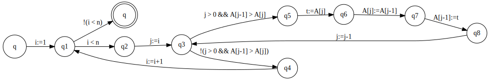

README file

# A parser for GCL

## Syntax for the GCL code
```
    C ::= x := a | A[a] := a | skip | C; C | if GC if | do GC do | continue | break 
    GC ::= b -> C | GC [] GC
    a ::= n | x | A[a] | a + a | a - a | a * a | a % a | a / a | -a | a ^ a | (a)
    b ::= true | false | b & b | b | b | b && b | b || b | !b | a = a | a != a | a > a | a >= a | a < a | a <= a | (b)
```

### Example program
```
i:=1;
    do i<n -> j:=i;
            do (j>0)&&(A[j-1]>A[j]) -> t:=A[j];
                                        A[j]:=A[j-1];
                                        A[j-1]:=t;
                                        j:=j-1
            od;
            i:=i+1
    od
```

### Menu Options
- Parse a GCL program
- Compile a GCL program into a program graph
- Execute a program
- Program verification


#### Parse a GCL program
Parsing the above GCL program will give the following output:
> OK, AST: Compose(Assign("i",Num(1)),Do(ExecuteIf(LTExpr(VAR("i"),VAR("n")),Compose(Assign("j",VAR("i")),Compose(Do(ExecuteIf(ANDExpr(GTExpr(VAR("j"),Num(0)),GTExpr(Array("A",MinusExpr(VAR("j"),Num(1))),Array("A",VAR("j")))),Compose(Assign("t",Array("A",VAR("j"))),Compose(ArrayAT("A",VAR("j"),Array("A",MinusExpr(VAR("j"),Num(1)))),Compose(ArrayAT("A",MinusExpr(VAR("j"),Num(1)),VAR("t")),Assign("j",MinusExpr(VAR("j"),Num(1)))))))),Assign("i",PlusExpr(VAR("i"),Num(1))))))))


#### Compile a GCL program into a program graph
This option will overwrite the file *graph.gv* which will contain a *graphviz* representation of the program graph:
```
    digraph program_graph {rankdir=LR;
    node [shape = circle]; q▷;
    node [shape = doublecircle]; q◀;
    node [shape = circle]
    q1 -> q◀ [label = "!(i < n)"];
    q1 -> q2 [label = "i < n"];
    q2 -> q3 [label = "j:=i"];
    q3 -> q4 [label = "!(j > 0 && A[j-1] > A[j])"];
    q3 -> q5 [label = "j > 0 && A[j-1] > A[j]"];
    q4 -> q1 [label = "i:=i+1"];
    q5 -> q6 [label = "t:=A[j]"];
    q6 -> q7 [label = "A[j]:=A[j-1]"];
    q7 -> q8 [label = "A[j-1]:=t"];
    q8 -> q3 [label = "j:=j-1"];
    q▷ -> q1 [label = "i:=1"];
    }
```

This can be visualized using a GV tool:


